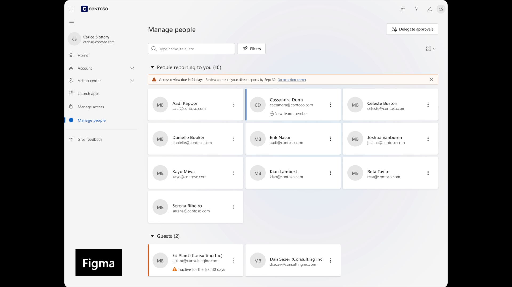
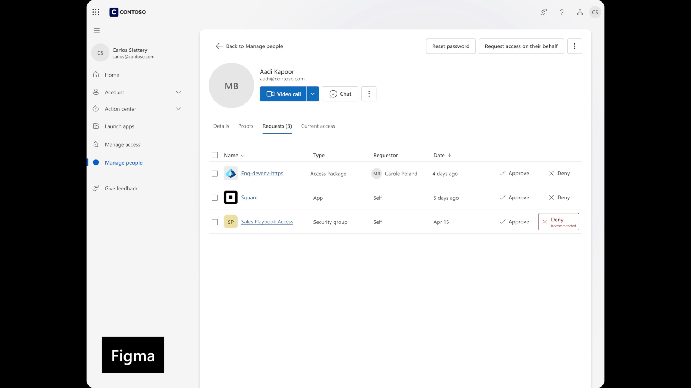

<div align="center">
    <h1>🎨 Design Intent for Spec-Driven Development</h1>
    <h3><em>If design systems are your language, design intent is your dialect</em></h3>
</div>

<p align="center">
    <strong>A design consistency layer for AI-driven development teams using <a href="https://github.com/github/spec-kit">Github/Spec Kit</a>. Captures how your team specifically applies design systems.</strong>
</p>

---

## Examples

Same codebase, same prompt, same Figma references using Figma MCP - but two different results when using design intent workflows versus letting the agent vibe code:

**With design intent:** 



- Correct component usage
- Responsive reflow follows established team patterns

**Without design intent:** 


- Starting from scratch each time
- Inconsistent spacing and component choices
- AI attempts responsive reflow using best guesses

---

## What is Design Intent?

**Design systems** provide the universal language - components, tokens, patterns that work everywhere.

**Design intent** captures your dialect - how your team specifically applies that language for your unique context.

### Language vs. Dialect Examples

**Language (Design System)**: Data display components (tables, cards, carousels)  
**Your Dialect**:
- **Enterprise**: "We default to tables for displaying data because users need to compare many items and export functionality"
- **Consumer**: "We use card grids and carousels because users browse smaller sets and prioritize visual appeal over density"

**Language (Design System)**: Standard spacing scale (8px, 16px, 24px...)  
**Your Dialect**:
- **Enterprise**: "We use 32px between sections for clear information hierarchy in dense dashboards"
- **Consumer**: "We use 48px between sections to create breathing room and reduce cognitive load"

---

## Prerequisites

**Learn spec-driven development first**: [github/spec-kit](https://github.com/github/spec-kit)

This project adds design intent workflows on top of spec-driven development. You'll need to understand feature specs and implementation plans before adding design consistency.

---

## Getting Started

**Dependencies:** Claude Code and Figma MCP server

```bash
git clone https://github.com/HugoPalomares/design-intent-for-sdd.git
cd design-intent-for-sdd
```

**Onboard your AI:**
```
Onboard yourself to this project by reading the CLAUDE.md file before we can continue.
```

✅ **AI now understands the design intent workflow and available commands**

---

## Design Intent Workflow

### 1. Visual Implementation (`/design`)

When you have visual references to implement directly:

```
/design [screenshot of dashboard]
```

**What happens:**
- Launches Design Intent Specialist (custom Claude Code sub-agent) for visual accuracy
- Reviews existing design patterns for consistency  
- Implements section by section (header, nav, main, footer)
- Handles conflicts between reference and existing patterns

### 2. Spec-Driven Implementation (`/feature` → `/plan` → `/implement`)

When building from feature specifications:

```
/feature "User dashboard with metrics widgets"
/plan
/implement
```

**What happens:**
- Create feature specification with `/feature`
- Generate implementation plan with `/plan`
- Execute plan with `/implement` (uses `/design` internally for UI components)
- Coordinates full-stack implementation while maintaining design consistency

### 3. Pattern Documentation (`/document-design-intent`)

After implementing and iteratively improving your app, reflect on patterns worth preserving:

```
/document-design-intent
```

**What happens:**
- Analyzes your iterative improvements and suggests which design decisions are worth preserving
- Presents summary for your review - **you choose what to document**
- Documents only your custom design dialect, not standard design system artifacts

---

## Key Commands

- `/feature [description]` - Create feature specification
- `/plan` - Generate implementation plan  
- `/design [reference]` - Implement from visual references
- `/implement` - Execute feature plan (design + engineering)
- `/document-design-intent` - Analyze and suggest design patterns to preserve
- `/diary` - Save session context and next steps for future agents

---

## File Structure

```
/design-intent/
  /components/        # Component-specific patterns
  /foundations/       # Base design decisions  
  /patterns/          # Layout and composition patterns
  design-intent-template.md  # Template for new patterns

/specs/               # Feature specifications and plans
/diary/               # Session documentation  
/memory/              # Project context and principles
```

---

## 🙏 Acknowledgements

This project is heavily influenced by and based on the work and research of [John Lam](https://github.com/jflam).
